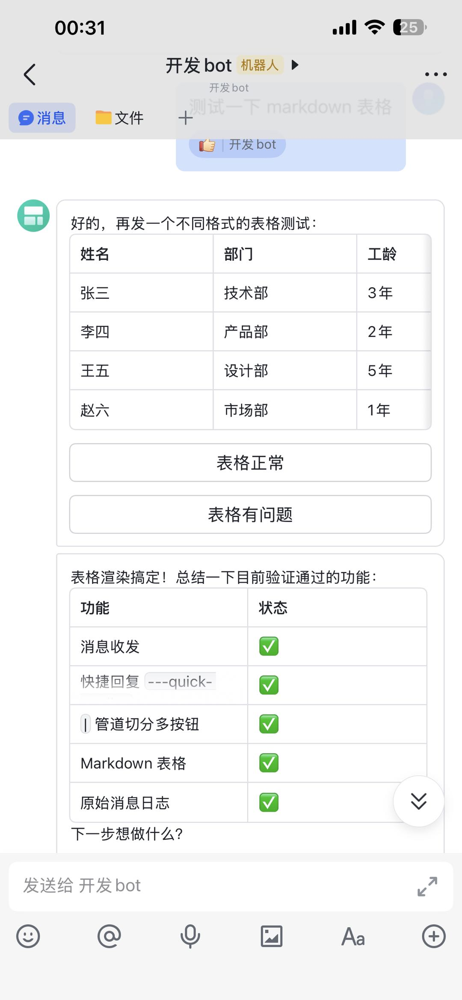

# feishu-cc

飞书 IM bridge for Claude Code CLI — 轻量 Python 桥接工具，将飞书消息实时转发给 Claude Code 子进程，并将 Claude 的回复（包括中间状态）实时推回飞书。

## 架构



```
飞书用户 ⇄ Feishu WS ⇄ feishu-cc ⇄ Claude Code 子进程 (JSON stream)
```

每个 Bot 独立运行：各自拥有 Feishu WebSocket 连接、asyncio 事件循环、Claude Code 子进程、workspace 和 session 文件。

## 特性

### 实时消息流
- **流式文字输出** — Claude 实时生成的文本逐字推送到飞书，无需等待完整回复
- **思考过程** — `💭` 前缀推送 Claude 内部推理过程（thinking 事件）
- **工具调用通知** — Claude 调用工具时实时推送通知（带对应 emoji），如 `📖 Read`, `💻 Bash`, `🔍 Grep`
- **工具结果摘要** — 工具执行结果摘要（截断至 100 字符），错误结果以 `❌` 标记
- **系统事件通知** — `✅ [status] summary` 格式推送 task_notification 等系统事件
- **错误事件推送** — `❌ type: message` 格式实时推送错误信息
- **结果摘要** — 回复完成后推送 `✅` 摘要，智能合并多个 content block

### 飞书原生交互
- **卡片消息** — 回复以飞书富文本卡片呈现，支持 Header、Markdown 正文
- **Quick Replies** — 回复中通过 `---quick-replies` 标记添加一键按钮
- **权限审批卡片** — Claude 请求权限时弹出 Allow / Deny 按钮卡片，支持 `allow_once` / `allow_this_time` / `deny`
- **自动降级** — 消息格式自动选择：富文本卡片 → 帖子 → 纯文本
- **表格保护** — Markdown 表格自动包裹代码块，防止飞书客户端渲染错乱
- **Reaction 表情** — 消息处理中自动添加表情，完成后移除并可选添加完成表情
- **引用消息** — 支持飞书引用消息，自动提取原文附在当前消息前

### 多 Bot 与并发
- **多 Bot 并行** — 一个配置文件运行多个飞书 Bot，各自完全隔离
- **独立线程模型** — 每 Bot 拥有独立线程 + asyncio 事件循环
- **跨线程通信** — 通过 `asyncio.run_coroutine_threadsafe` 安全跨线程调度
- **消息去重** — 30 秒滑动窗口去重，防止重复处理

### 智能容错
- **Crash 自动恢复** — Claude 子进程崩溃后自动重启，最多重试 3 次
- **指数退避** — 重启等待时间 2s → 4s → 8s（最大 30s）
- **自愈机制** — 定时扫描日志文件中的 ERROR 日志，自动重启异常的 Claude 子进程（仅检测当前版本的新增错误）
- **单实例锁** — PID 文件防止多开，确保同一时间只有一个 feishu-cc 进程运行
- **日志持久化** — DEBUG 级别日志自动写入文件，支持 10MB rotation 和 30 天 retention
- **过期事件过滤** — `_response_gen` 计数器过滤旧会话残留事件，防止消息串线
- **init 失败恢复** — 初始化失败自动清除过期 session 文件并重试
- **stderr 诊断** — 进程崩溃时自动输出 stderr 尾部（80 行）辅助排查
- **进程组隔离** — Windows 上创建独立进程组，防止 Ctrl+C 误杀 Claude 子进程

### 启动与通知
- **主动启动通知** — 启动后自动向上次对话的 chat 发送就绪信息（时间、目录、workspace）
- **首次消息上下文** — 用户首次发消息时，自动附加启动上下文信息
- **`/workspace` 命令** — 对话中输入 `/workspace <path>` 热切换工作目录
- **`/tool` 命令** — 对话中输入 `/tool` 切换工具调用消息的推送（默认关闭）
- **`/think` 命令** — 对话中输入 `/think` 切换思考内容的推送（默认关闭）
- **空闲状态提示** — 每条消息处理完成后发送 `✅ 空闲` 状态通知
- **处理超时通知** — 超时（300s）时提示用户重试

### 图片与附件
- **图片接收** — 自动下载飞书图片消息（支持 PNG/JPG/GIF 格式检测）
- **文件接收** — 自动下载飞书文件消息，将本地路径传给 Claude 处理
- **临时文件清理** — 自动清理超过 24 小时的临时文件

### 会话管理
- **会话持久化** — session ID 自动保存到文件，重启时 `--resume` 自动恢复
- **最近聊天记录** — 自动保存最后对话的 chat_id，重启后主动通知
- **自定义 System Prompt** — 每个 Bot 可单独配置 system prompt，也支持全局默认 prompt

### 可配置性
- **渲染模式** — `card` / `post` / `auto` 三种消息渲染模式
- **Reaction 自定义** — 可配置处理中和完成时的表情类型
- **Claude 路径** — 自定义 `claude` CLI 路径
- **多域支持** — 支持 `feishu` 和 `larksuite` 域名
- **camelCase / snake_case** — 配置键同时支持两种命名风格

### 跨平台
- **Windows 兼容** — 专用线程读取 stdout，避免 Windows 4KB pipe buffer 死锁
- **Unix 兼容** — 同样线程模型确保跨平台一致性
- **Python 3.9+** — 仅依赖 `lark_oapi` 和 `loguru`

## 安装

```bash
pip install feishu-cc
```

或从源码安装：

```bash
git clone https://github.com/MaoChen1980/feishu-cc.git
cd feishu-cc
pip install -e .
```

## 配置

创建 `~/.feishu-cc/config.json`。首次运行会自动生成模板然后退出：

```bash
feishu-cc
# → Template config created at ~/.feishu-cc/config.json. Please edit it.
```

编辑配置文件：

```json
{
  "bots": [
    {
      "name": "my-bot",
      "appId": "cli_xxxxxxxxxxxxxxxxxxxx",
      "appSecret": "xxxxxxxxxxxxxxxxxxxxxxxxxxxxxx",
      "workspace": "/path/to/workspace",
      "system_prompt": null
    }
  ],
  "domain": "feishu",
  "claude_path": "claude",
  "render_mode": "card",
  "react_emoji": "THUMBSUP",
  "done_emoji": null
}
```

### 配置项

| 字段 | 类型 | 默认值 | 说明 |
|------|------|--------|------|
| `bots[].name` | string | — | Bot 名称，用于日志和 session 文件命名 |
| `bots[].appId` | string | — | 飞书应用 App ID |
| `bots[].appSecret` | string | — | 飞书应用 App Secret |
| `bots[].workspace` | string | null | Claude Code 工作目录（可选，默认启动目录） |
| `bots[].system_prompt` | string | null | 自定义 system prompt（可选） |
| `domain` | string | `"feishu"` | `"feishu"` 或 `"larksuite"` |
| `claude_path` | string | `"claude"` | `claude` CLI 路径或命令 |
| `render_mode` | string | `"card"` | `"card"` / `"post"` / `"auto"` |
| `react_emoji` | string | `"THUMBSUP"` | 消息处理中时的飞书表情 |
| `done_emoji` | string | null | 消息处理完成后的飞书表情（可选） |

配置项同时支持 camelCase（`appId`）和 snake_case（`app_id`）两种写法。

## 使用

```bash
# 默认配置 ~/.feishu-cc/config.json
feishu-cc

# 指定配置文件
feishu-cc --config /path/to/config.json

# 指定日志级别
feishu-cc --log-level DEBUG
```

### 多 Bot 示例

```json
{
  "bots": [
    {
      "name": "nanobot",
      "appId": "cli_aaaa",
      "appSecret": "secret_aaaa",
      "workspace": "/projects/nanobot",
      "system_prompt": "你是 nanobot 项目的助手。"
    },
    {
      "name": "helper",
      "appId": "cli_bbbb",
      "appSecret": "secret_bbbb",
      "workspace": null,
      "system_prompt": null
    }
  ]
}
```

每个 Bot 拥有独立的 Feishu 连接、Claude Code 子进程、workspace、session 和 system prompt。

## Quick Replies

Claude 的回复中可以通过 `---quick-replies` 提供一键按钮：

```
觉得如何？
---quick-replies
很好||analyze:positive
一般||analyze:neutral
很差||analyze:negative
```

按钮格式：
- `Label||发送内容` — 按钮显示 `Label`，点击后发送指定内容
- `Option` — 只写文字，按钮显示和发送内容相同
- 多个选项用 `|` 分隔或换行分开

## JSON Stream 协议

与 Claude CLI 通过 `--output-format stream-json --input-format stream-json` 通信：

| 方向 | 格式 | 说明 |
|------|------|------|
| stdin → claude | `{"type":"user","message":{"role":"user","content":text}}` | 发送用户消息 |
| stdin → claude | `{"type":"control_response","response":{"subtype":"success","request_id":"...","response":{"behavior":"allow\|deny"}}}` | 权限响应 |
| stdout ← claude | 每行一个 JSON 事件 | 见下方事件类型 |

### 事件类型

| 事件 | 说明 |
|------|------|
| `text` | Claude 实时生成的文本 |
| `thinking` | 模型内部推理过程 |
| `tool_use` | 工具调用（Read / Write / Bash 等） |
| `tool_result` | 工具执行结果 |
| `system` | 系统事件（session 建立、任务通知等） |
| `error` | 错误事件 |
| `result` | 最终回复结果 |
| `control_request` | 权限请求 |

## 飞书开放平台配置注意事项

使用 feishu-cc 时，飞书应用需使用 **长连接（WebSocket）** 方式接收事件，**不能填写 HTTP 回调 URL**。

### 常见问题

1. **服务器 URL 干扰** — 在飞书开放平台后台同时配置了服务器 URL（HTTP 回调）时，飞书可能优先将事件 POST 到该地址而非走 WebSocket。即使选择的是长连接，已填写的 URL 仍会干扰事件投递。**解决**：在飞书开放平台 → 你的应用 → 事件与回调 → 回调配置 中清空服务器 URL。

2. **事件订阅** — 确保已添加以下 Event：
   - `im.message.receive_v1`（接收消息）
   - `card.action.trigger`（卡片按钮回调）

3. **权限** — 确保应用已获取 `im:message`、`im:chat` 等必要的权限范围。

4. **图片** — 如需接收图片消息，添加 `im:resource` 权限。

## 测试

```bash
pip install pytest
pytest

# 带覆盖率
pytest --cov=feishu_cc

# 类型检查
mypy src/feishu_cc/
```

## 许可

MIT
